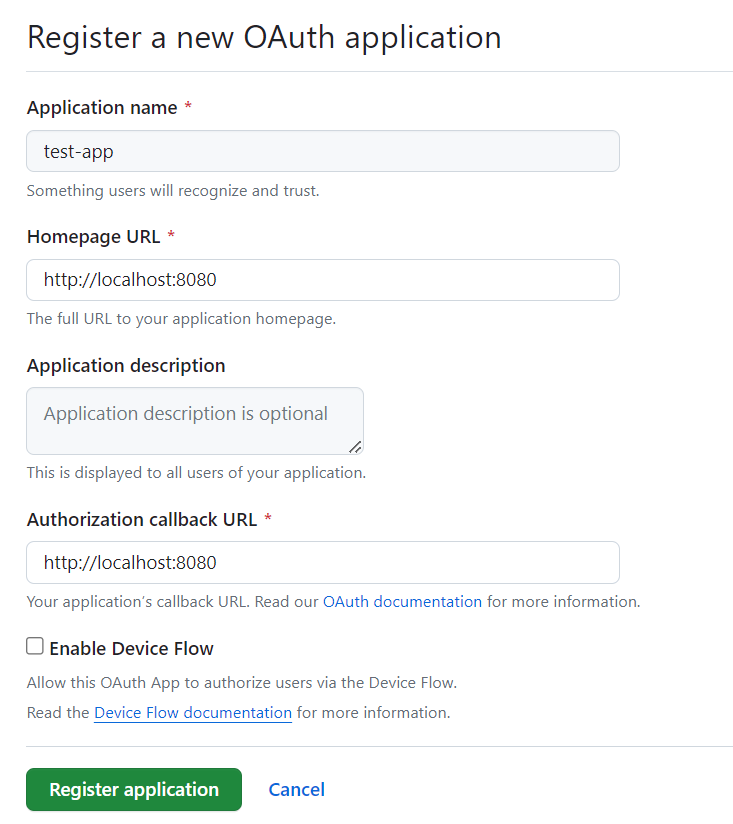
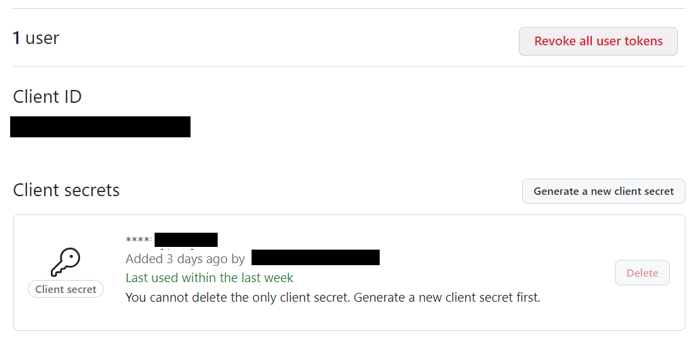
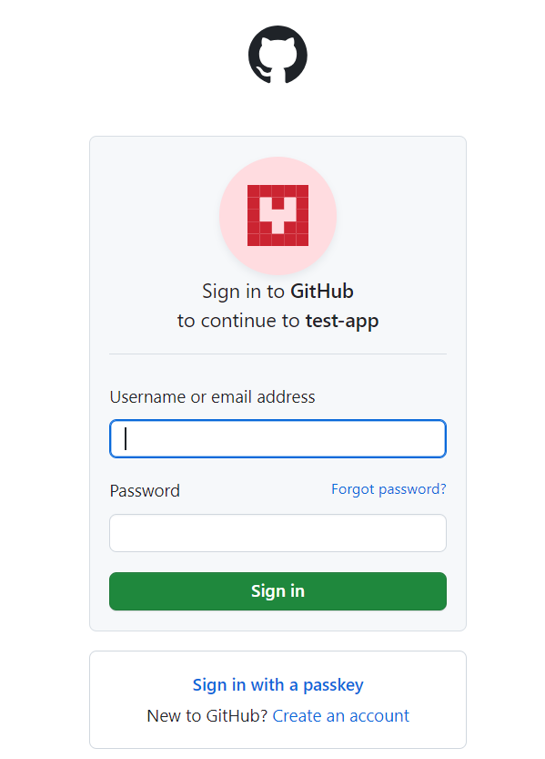

# Oauth2 - Spring Boot
This project will include various usecases of the OAuth2 standard for authentication and authorization using Spring Boot framework. Students who are willing to learn or professionals who want to use it for business or technical purposes are both welcome to benefit from it.

# Github
You can start by implementing a simple usecase using Github as an authorization server.

### Step 1: Create a new Github application

Create a Github account if you don't have one and login into it. Then, register your application in order to use it as a client with Github as an authorization server.
You can register by accessing the following link and filling the form : https://github.com/settings/applications/new

As a result, you receive your client credentials (client id and client secret) that you will use in your application.

### Step 2: Set environment variables and Spring profile

Set your client credentials as environment variables in your system.

GITHUB_CLIENT_ID=your_client_id
GITHUB_CLIENT_SECRET=your_client_secret

Then, set the spring profiles within the VM options : 
-Dspring.profiles.active=github-spring-convention
or
-Dspring.profiles.active=github-configuration

The first profile makes use of Spring Boot's convention over configuration principle, internally registering the client based on OAuth2 properties set in the yaml file.
The second makes use of an explicit hardcoded configuration

### Step 3: You start the project and access the resource

Make sure you aren't already logged in to Github. Then, access the resource endpoint in your browser:
http://localhost:8080/MyResources

The page will first redirect you to the Github login page : 

After a successful log in, you will be redirected to the resource page and receive the response : 

    {"name":"My Resource"}
